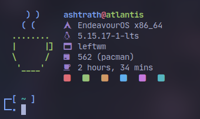

<p align="center">
  
</p>
<h1 align="center"> coffee-fetch </h1>

Yet another fetching tool written in POSIX shell.

Why i made this? Cause [neofetch](https://github.com/dylanaraps/neofetch) is slow *(Yes, i put neofetch on my shellrc.)*

Execution time is really important for me, thats why i made this simple fetching tool.

## Installation
```sh
# Curl `cfetch` into your PATH e.g ~/.local/bin and give execute permissions.
install -m755 /dev/stdin ~/.local/bin/cfetch << CFETCH
$(curl -sL https://raw.githubusercontent.com/Dyzean/coffee-fetch/main/cfetch)
CFETCH

# Prepare your coffee and relax.
cfetch
```

## Credits
 - [NerdFetch](https://github.com/ThatOneCalculator/NerdFetch) & [neofetch](https://github.com/dylanaraps/neofetch) for Inspiration.
 - [owl4ce](https://github.com/owl4ce) for POSIX shell rewrite.
